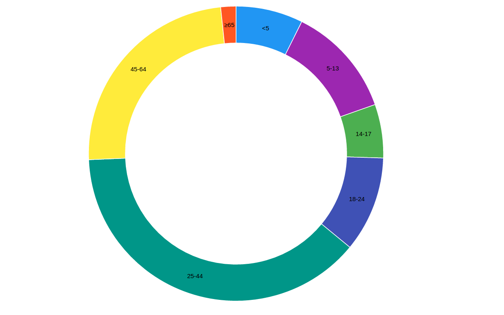
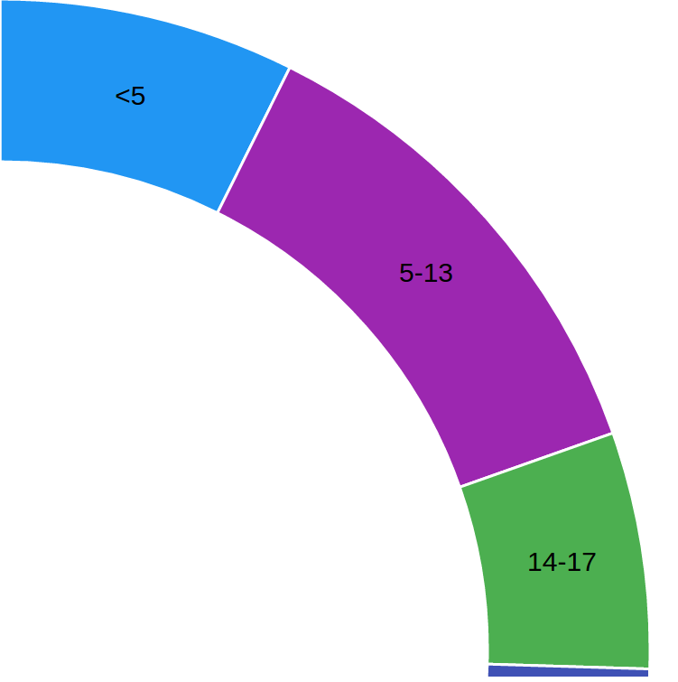

# D3-Click-Zoom




## About
This project is Click-Zoom using D3.js.
This D3-Click-Zoom example is written by [Big Silver].

## Quick Start

```bash
# clone our repo
$ git clone https://github.com/Big-Silver/D3-Click-Zoom.git D3-Click-Zoom

# change directory to your app
$ cd D3-Click-Zoom

# Run the D3.js app.

```
## data.csv

```html
age,population
<5,2704659
5-13,4499890
14-17,2159981
18-24,3853788
25-44,14106543
45-64,8819342
≥65,612463

```
